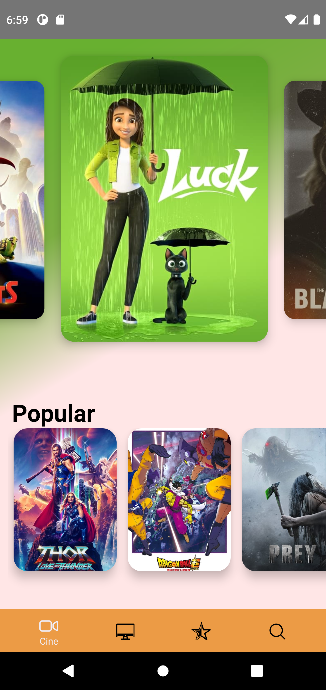
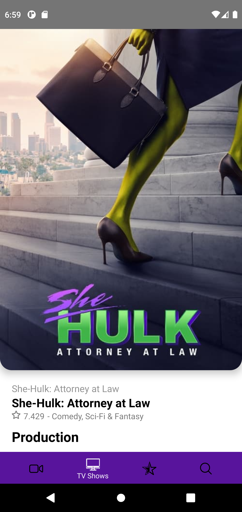
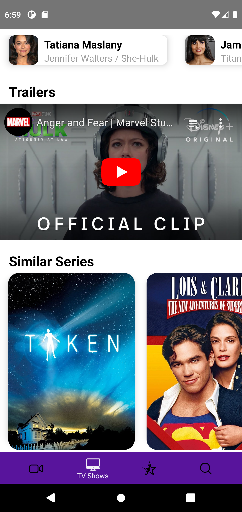
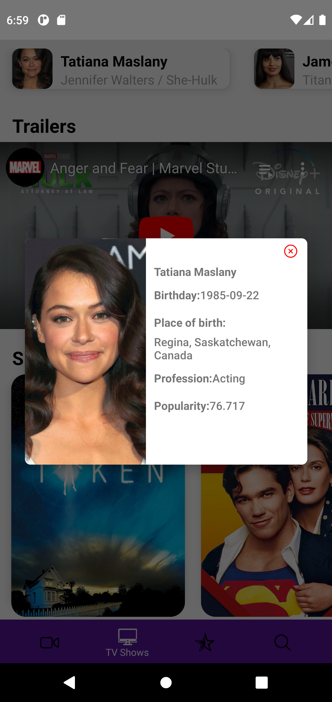
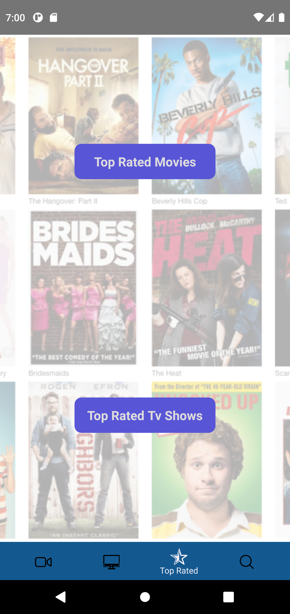
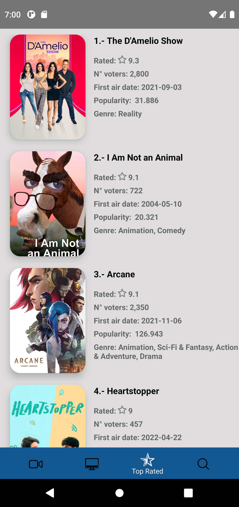

# Movies&TV Shows / Series

A mobile app where you can find Movies and Tv Series. Built in React Native as a learning project.

## Some screens about it

<p align="center">
  
  
  
  
  
  
</p>


## Development environment

### Important!!!
This application has not been tested on iOS platform!!!

### Minimum requirements

- [Nodejs (LTS)](https://nodejs.org/es/).
- [React +v18.0.0](https://es.reactjs.org/).
- [React Native +v0.69.1](https://reactnative.dev/).
- [Android Studio](https://developer.android.com/studio).
- Android version 9+.

Run in the root of the project:

```sh
$ npm install

To init Metro:
$ npx react-native

To init Android:
$ npx run-android
```

## References

### Development resources

- [NPM](https://docs.npmjs.com/): NPM is the world's largest software registry.
- [React Native](https://reactnative.dev/): A JavaScript library for building mobile user interfaces.
- [Typescript](https://www.typescriptlang.org/): A strongly typed programming language that builds on JavaScript, giving you better tooling at any scale.
- [React Navigation](https://reactnavigation.org/): Routing and navigation for Expo and React Native apps.
- [React Native Image Colors](https://www.npmjs.com/package/react-native-image-colors): Fetch prominent colors from and image.
- [React Native Linear Gradient](https://www.npmjs.com/package/react-native-linear-gradient): A "LinearGradient" element for React Native.
- [React Native Snap Carousel](https://github.com/meliorence/react-native-snap-carousel): Swiper/carousel component for React Native featuring previews, multiple layouts, parallax images, performant handling of huge numbers of items, and more.
- [React Native Splash Screen](https://www.npmjs.com/package/react-native-splash-screen): A splash screen API for react-native which can programatically hide and show the splash screen.
- [React Native Youtube iframe](https://www.npmjs.com/package/react-native-youtube-iframe): A wrapper of the Youtube IFrame player API build for react native.